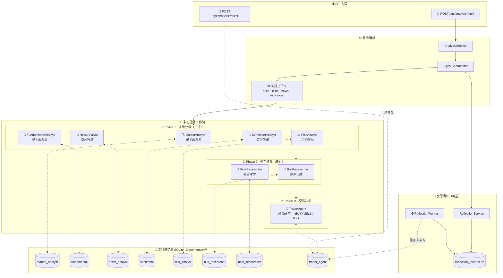

<div align="center">
  <a href="README.md">🇺🇸 English</a> |
  <a href="README_CN.md">🇨🇳 简体中文</a> |
  <a href="README_TW.md">🇹🇼 繁體中文</a> |
  <a href="README_JA.md">🇯🇵 日本語</a> |
  <a href="README_KO.md">🇰🇷 한국어</a>
</div>
<br/>

<div align="center">
  <a href="https://github.com/brokermr810/QuantDinger">
    
  </a>

  <h1 align="center">QuantDinger</h1>

  <p align="center">
    <strong>🤖 AI 原生 · 🔒 隐私优先 · 🚀 全能量化工作台</strong>
  </p>
  <p align="center">
    <i>下一代本地量化平台：多市场数据、AI 投研、可视化回测与自动交易。</i>
  </p>

  <p align="center">
    <a href="https://www.quantdinger.com"><strong>官网</strong></a> ·
    <a href="https://ai.quantdinger.com"><strong>在线演示</strong></a> ·
    <a href="https://github.com/brokermr810/QuantDinger/issues"><strong>报告 Bug</strong></a> ·
    <a href="https://github.com/brokermr810/QuantDinger/discussions"><strong>讨论区</strong></a>
  </p>

  <p align="center">
    <a href="LICENSE"></a>
    
    
    
    
  </p>

  <p align="center">
    <a href="https://t.me/worldinbroker"></a>
    <a href="https://discord.gg/cn6HVE2KC"></a>
    <a href="https://x.com/HenryCryption"></a>
  </p>
</div>

---

## 📖 简介

**QuantDinger** 是一个专为交易员、研究员和极客设计的**本地优先**（Local-First）量化交易工作台。

与昂贵的 SaaS 平台不同，QuantDinger 将**数据所有权**归还给你。它内置了一个**基于 LLM 的多智能体投研团队**，能够自动从网络收集金融情报，结合本地行情数据，生成专业的分析报告，并与你的策略开发、回测及实盘交易流程无缝集成。

### 核心价值
- **🛡️ 隐私优先**：所有策略、交易日志和 API 密钥都存储在你的本地 SQLite 数据库中。
- **🧠 AI 赋能**：不仅是代码补全，更是真正的 AI 投研分析师（由 OpenRouter/LLM 驱动）。
- **⚡ 多市场支持**：原生支持 **加密货币**、**美股**、**A股/港股**、**外汇** 和 **期货**。
- **🔌 开箱即用**：通过 Docker 一键部署。无需复杂的环境配置。

---

## 📚 文档
- [Python 策略开发指南](docs/STRATEGY_DEV_GUIDE_CN.md)

## 📸 功能预览

<div align="center">
  <h3>📊 专业量化仪表盘</h3>
  <p>实时监控市场动态、资产状况和策略状态。</p>
  
</div>

<br/>

<table align="center" width="100%">
  <tr>
    <td width="50%" align="center" valign="top">
      <h3>🤖 AI 深度投研</h3>
      <p>多智能体协作进行市场情绪与技术分析。</p>
      
    </td>
    <td width="50%" align="center" valign="top">
      <h3>💬 智能交易助手</h3>
      <p>通过自然语言接口获取即时市场洞察。</p>
      
    </td>
  </tr>
  <tr>
    <td width="50%" align="center" valign="top">
      <h3>📈 交互式指标分析</h3>
      <p>丰富的技术指标库，支持拖拽式分析。</p>
      
    </td>
    <td width="50%" align="center" valign="top">
      <h3>🐍 Python 策略生成</h3>
      <p>内置编辑器，支持 AI 辅助策略代码编写。</p>
      
    </td>
  </tr>
</table>

---

## ✨ 关键特性

### 1. 通用数据引擎
无需再为数据 API 发愁。QuantDinger 采用了强大的数据源工厂模式：
- **加密货币**：**直连交易所 API** 进行交易（支持 10+ 交易所），结合 **CCXT** 获取行情数据（支持 100+ 来源）。
- **股票**：集成 Yahoo Finance、Finnhub、Tiingo (美股) 和 AkShare (A股/港股)。
- **期货/外汇**：支持 OANDA 及主要期货数据源。
- **代理支持**：内置代理配置，适应受限网络环境。

### 2. AI 多智能体投研
你不知疲倦的分析师团队：
- **协调智能体**：拆解任务并管理工作流。
- **搜索智能体**：进行全网搜索（Google/Bing）获取宏观新闻。
- **加密/股票智能体**：专注于特定市场的技术和资金流向分析。
- **报告生成**：自动产出结构化的日报/周报。

### 2.1 🧠 AI 记忆增强系统（Memory-Augmented Agents）
QuantDinger 的多智能体不是“每次从零开始”。它内置了一个**本地记忆库 + 反思闭环**，让每个智能体在生成提示词（prompt）时能检索过往经验，并在事后验证/复盘后把结果写回记忆库。

- **本质**：RAG 风格的“经验检索增强”，**不是**训练/微调模型权重（零外部向量库依赖）。
- **隐私**：所有记忆与反思记录默认落盘在本地 SQLite：`backend_api_python/data/memory/`。

#### 逻辑图（从请求到记忆闭环）



#### 1) 记忆是如何“注入提示词”的？
每个 agent 在 `analyze()` 时会：
- **构造 situation**：例如 `"{market}:{symbol} fundamental analysis"`、`"{market}:{symbol} trading decision"` 等
- **携带结构化 metadata**：`market/symbol/timeframe` + `memory_features`（价格、涨跌幅、技术指标等）
- **检索 Top-K 历史经验**：转成一段可读的 `memory_prompt`
- **拼进 system_prompt**：模型在做本次分析前先“读历史经验”

你可以在这些文件里看到同样的模式：
- `backend_api_python/app/services/agents/base_agent.py`：`get_memories()` + `format_memories_for_prompt()`
- `backend_api_python/app/services/agents/*_agents.py`、`trader_agent.py`：把 `memory_prompt` 拼进 system prompt

#### 2) 记忆检索算法（为什么“像”RAG？）
每个角色的记忆表保存（简化）：
- **situation / recommendation / result / returns**
- **market / symbol / timeframe / features_json**
- **embedding（可选 BLOB）**：本地“哈希向量”嵌入（无外部依赖）

检索时会从最近 `AGENT_MEMORY_CANDIDATE_LIMIT` 条候选中打分排序：
\[
score = w_{sim}\cdot sim + w_{recency}\cdot recency + w_{returns}\cdot returns\_score
\]

- **sim**：默认用 embedding cosine，相同维度的本地哈希向量；没有 embedding 时退化为 difflib 文本相似度
- **recency**：半衰期衰减（`AGENT_MEMORY_HALF_LIFE_DAYS`）
- **returns_score**：对收益做 `tanh` 压缩，避免极值支配排序
- **timeframe 惩罚**：如果查询 timeframe 与记忆记录 timeframe 不一致，会额外扣分

#### 3) “学习”从哪里来？（两条写入通道）
- **自动反思（可选）**：
  - 分析结束后，系统会把 BUY/SELL/HOLD 记录到 `reflection_records.db`
  - 开启 `ENABLE_REFLECTION_WORKER=true` 后，后台线程会按 `REFLECTION_WORKER_INTERVAL_SEC` 轮询到期记录，拉取最新价格做验证，并把验证结果写回 `trader_agent_memory.db`
- **手动复盘（推荐）**：
  - 调用 `POST /api/analysis/reflect`，把你的真实交易结果（returns/result）写回记忆库，用于后续决策增强

#### 4) 关键环境变量（`.env`）
- **ENABLE_AGENT_MEMORY**：是否启用记忆增强（默认 true）
- **AGENT_MEMORY_TOP_K**：每次注入的经验条数（默认 5）
- **AGENT_MEMORY_CANDIDATE_LIMIT**：候选池大小（默认 500）
- **AGENT_MEMORY_ENABLE_VECTOR**：是否启用 embedding cosine（默认 true；否则退化为文本相似）
- **AGENT_MEMORY_EMBEDDING_DIM**：哈希 embedding 维度（默认 256）
- **AGENT_MEMORY_HALF_LIFE_DAYS**：时间衰减半衰期（默认 30）
- **AGENT_MEMORY_W_SIM / W_RECENCY / W_RETURNS**：三项权重（默认 0.75 / 0.20 / 0.05）
- **ENABLE_REFLECTION_WORKER**：是否启用自动验证闭环（默认 false）
- **REFLECTION_WORKER_INTERVAL_SEC**：自动验证周期（默认 86400 秒）

### 3. 稳健的策略运行时
- **基于线程的执行器**：独立的线程池管理策略执行。
- **自动恢复**：系统重启后自动恢复运行中的策略。
- **挂单工作线程**：可靠的后台队列确保信号精准执行，防止滑点。

### 4. 现代技术栈
- **后端**：Python (Flask) + SQLite + Redis (可选) — 简洁、强大、易扩展。
- **前端**：Vue 2 + Ant Design Vue + KlineCharts/ECharts — 响应式且交互丰富。
- **部署**：Docker Compose 编排。

---

## 🏦 支持的交易所与返佣

QuantDinger 支持**直连**主要加密货币交易所进行低延迟执行，同时利用 **CCXT** 覆盖广泛的行情数据。

> 💡 **独家福利**：通过下方的合作伙伴链接注册账户，可享受**交易手续费减免**和**独家赠金**。这将在不增加你成本的情况下支持本项目！

| 交易所 | 特点 | 注册福利 |
|:--------:|:---------|:-------------:|
|  | 🥇 **全球最大**<br/>现货, 合约, 杠杆 | <a href="https://www.bmwweb.ac/referral/earn-together/refer2earn-usdc/claim?hl=zh-CN&ref=GRO_28502_9OSOJ"></a> |
|  | 🚀 **Web3 & 衍生品**<br/>现货, 永续, 期权 | <a href="https://www.bjwebptyiou.com/join/14449926"></a> |
|  | 👥 **社交交易**<br/>跟单交易, 合约 | <a href="https://share.glassgs.com/u/H8XZGS71"></a> |

<br>

**同时也支持 (直连/CCXT):**

|  |  |  |  |  |
|:---:|:---:|:---:|:---:|:---:|


---

### 多语言支持

QuantDinger 为全球用户构建，提供全面的国际化支持：

<p>
  
  
  
  
  
  
  
  
  
  
</p>

所有 UI 元素、错误信息和文档均已完全翻译。语言会根据浏览器设置自动检测，也可以在应用中手动切换。

---

### 支持的市场

| 市场类型 | 数据源 | 交易 |
|-------------|--------------|---------|
| **加密货币** | Binance, OKX, Bitget, + 100 交易所 | ✅ 全面支持 |
| **美股** | Yahoo Finance, Finnhub, Tiingo | ✅ 通过券商 API |
| **A股/港股** | AkShare, 东方财富 | ⚡ 仅数据 |
| **外汇** | Finnhub, OANDA | ✅ 通过券商 API |
| **期货** | 交易所 API, AkShare | ⚡ 仅数据 |

---

### 架构 (当前仓库)

```text
┌─────────────────────────────┐
│      quantdinger_vue         │
│   (Vue 2 + Ant Design Vue)   │
└──────────────┬──────────────┘
               │  HTTP (/api/*)
               ▼
┌─────────────────────────────┐
│     backend_api_python       │
│   (Flask + 策略运行时)       │
└──────────────┬──────────────┘
               │
               ├─ SQLite (quantdinger.db)
               ├─ Redis (可选缓存)
               └─ 数据提供商 / LLMs / 交易所
```

---

### 仓库目录结构

```text
.
├─ backend_api_python/         # Flask API + AI + 回测 + 策略运行时
│  ├─ app/
│  ├─ env.example              # 复制为 .env 进行本地配置
│  ├─ requirements.txt
│  └─ run.py                   # 入口点
└─ quantdinger_vue/            # Vue 2 UI (开发服务器代理 /api -> 后端)
```

---

## 快速开始

### 选项 1: Docker 部署 (推荐)

运行 QuantDinger 最快的方式。

#### 1. 一键启动

**Linux / macOS**
```bash
git clone https://github.com/brokermr810/QuantDinger.git && \
cd QuantDinger && \
cp docker.env.example backend_api_python/.env && \
docker-compose up -d --build
```

**Windows (PowerShell)**
```powershell
git clone https://github.com/brokermr810/QuantDinger.git
cd QuantDinger
Copy-Item docker.env.example -Destination backend_api_python\.env
docker-compose up -d --build
```

#### 2. 访问与配置

- **前端 UI**: http://localhost:8888
- **默认账号**: `quantdinger` / `123456`

> **注意**：为了使用 AI 功能或生产环境安全，请编辑 `backend_api_python/.env`（添加 `OPENROUTER_API_KEY`，修改密码），然后执行 `docker-compose restart backend` 重启服务。

#### 3. 访问应用

- **前端 UI**: http://localhost
- **后端 API**: http://localhost:5000

#### Docker 命令参考

```bash
# 查看运行状态
docker-compose ps

# 查看日志
docker-compose logs -f

# 停止服务
docker-compose down

# 停止并删除卷 (警告：会删除数据库！)
docker-compose down -v
```

#### 数据持久化

以下数据挂载到主机，重启容器后依然保留：

```yaml
volumes:
  - ./backend_api_python/logs:/app/logs                       # 日志
  - ./backend_api_python/data:/app/data                       # 数据目录（包含 quantdinger.db）
  - ./backend_api_python/.env:/app/.env                       # 配置文件
```

---

### 选项 2: 本地开发

**先决条件**
- 推荐 Python 3.10+
- 推荐 Node.js 16+

#### 1. 启动后端 (Flask API)

```bash
cd backend_api_python
pip install -r requirements.txt
cp env.example .env   # Windows: copy env.example .env
python run.py
```

后端将在 `http://localhost:5000` 上可用。

#### 2. 启动前端 (Vue UI)

```bash
cd quantdinger_vue
npm install
npm run serve
```

前端开发服务器运行在 `http://localhost:8000` 并将 `/api/*` 代理到 `http://localhost:5000`。

---

### 配置 (.env)

使用 `backend_api_python/env.example` 作为模板。常用设置包括：

- **认证**: `SECRET_KEY`, `ADMIN_USER`, `ADMIN_PASSWORD`
- **服务器**: `PYTHON_API_HOST`, `PYTHON_API_PORT`, `PYTHON_API_DEBUG`
- **AI / LLM**: `OPENROUTER_API_KEY`, `OPENROUTER_MODEL`
- **网络搜索**: `SEARCH_PROVIDER`, `SEARCH_GOOGLE_*`, `SEARCH_BING_API_KEY`
- **代理 (可选)**: `PROXY_PORT` 或 `PROXY_URL`

---

## 🤝 社区与支持

加入我们的全球社区进行策略分享和技术支持：

- **Telegram (官方)**: [t.me/worldinbroker](https://t.me/worldinbroker)
- **Discord**: [Join Server](https://discord.gg/cn6HVE2KC)
- **YouTube**: [@quantdinger](https://youtube.com/@quantdinger)
- **Email**: [brokermr810@gmail.com](mailto:brokermr810@gmail.com)
- **GitHub Issues**: [提交 Bug / 功能请求](https://github.com/brokermr810/QuantDinger/issues)

---

## ☕ 支持本项目

如果 QuantDinger 帮助你获利，请考虑给开发者买杯咖啡。你的支持让项目持续发展！

**ERC-20 / BEP-20 / Polygon / Arbitrum**
```
0x96fa4962181bea077f8c7240efe46afbe73641a7
```


---

### 商业服务

我们提供专业服务，助你充分利用 QuantDinger：

| 服务 | 描述 |
|---------|-------------|
| **部署与设置** | 一对一协助服务器部署、配置和优化 |
| **定制策略开发** | 针对特定需求和市场定制交易策略 |
| **企业版升级** | 商业授权、优先支持和企业级高级功能 |
| **培训与咨询** | 为你的交易团队提供实战培训和战略咨询 |

**感兴趣？** 联系我们：
- 📧 Email: [brokermr810@gmail.com](mailto:brokermr810@gmail.com)
- 💬 Telegram: [@worldinbroker](https://t.me/worldinbroker)

---

### 致谢

QuantDinger 站在这些伟大的开源项目肩膀之上：Flask, Pandas, CCXT, Vue.js, Ant Design Vue, KlineCharts 等。

感谢所有维护者和贡献者！ ❤️

