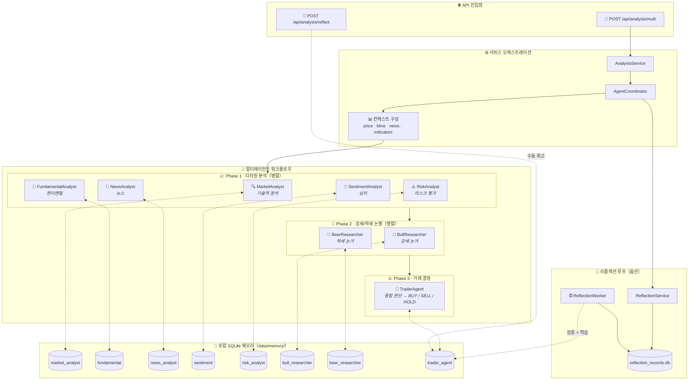

<div align="center">
  <a href="README.md">🇺🇸 English</a> |
  <a href="README_CN.md">🇨🇳 简体中文</a> |
  <a href="README_TW.md">🇹🇼 繁體中文</a> |
  <a href="README_JA.md">🇯🇵 日本語</a> |
  <a href="README_KO.md">🇰🇷 한국어</a>
</div>
<br/>

<div align="center">
  <a href="https://github.com/brokermr810/QuantDinger">
    
  </a>

  <h1 align="center">QuantDinger</h1>

  <p align="center">
    <strong>🤖 AI 네이티브 · 🔒 프라이버시 우선 · 🚀 올인원 퀀트 워크스페이스</strong>
  </p>
  <p align="center">
    <i>차세대 로컬 퀀트 플랫폼: 멀티 마켓 데이터, AI 리서치, 시각적 백테스팅 및 자동 거래.</i>
  </p>

  <p align="center">
    <a href="https://www.quantdinger.com"><strong>웹사이트</strong></a> ·
    <a href="https://ai.quantdinger.com"><strong>라이브 데모</strong></a> ·
    <a href="https://github.com/brokermr810/QuantDinger/issues"><strong>버그 신고</strong></a> ·
    <a href="https://github.com/brokermr810/QuantDinger/discussions"><strong>토론</strong></a>
  </p>

  <p align="center">
    <a href="LICENSE"></a>
    
    
    
    
  </p>

  <p align="center">
    <a href="https://t.me/worldinbroker"></a>
    <a href="https://discord.gg/cn6HVE2KC"></a>
    <a href="https://x.com/HenryCryption"></a>
  </p>
</div>

---

## 📖 소개

**QuantDinger**는 트레이더, 연구원 및 괴짜들을 위해 설계된 **로컬 우선(Local-First)** 퀀트 거래 워크스페이스입니다.

비싼 SaaS 플랫폼과 달리, QuantDinger는 **데이터 소유권**을 귀하에게 돌려드립니다. **LLM 기반 멀티 에이전트 리서치 팀**이 내장되어 있어 웹에서 금융 정보를 자율적으로 수집하고, 로컬 시장 데이터와 결합하여 전문 분석 보고서를 생성하며, 전략 개발, 백테스팅 및 실거래 워크플로우와 원활하게 통합됩니다.

### 핵심 가치
- **🛡️ 프라이버시 우선**: 모든 전략, 거래 로그 및 API 키는 로컬 SQLite 데이터베이스에 저장됩니다.
- **🧠 AI 강화**: 단순한 코드 완성이 아닌, OpenRouter/LLM으로 구동되는 진정한 AI 리서치 애널리스트입니다.
- **⚡ 멀티 마켓**: **암호화폐**, **미국 주식**, **중국/홍콩 주식**, **외환** 및 **선물**을 기본 지원합니다.
- **🔌 즉시 사용 가능**: Docker를 통한 원클릭 배포. 복잡한 환경 설정이 필요 없습니다.

---

## 📚 문서
- [Python 전략 개발 가이드](docs/STRATEGY_DEV_GUIDE_KO.md)

## 📸 비주얼 투어

<div align="center">
  <h3>📊 전문 퀀트 대시보드</h3>
  <p>시장 역학, 자산 및 전략 상태에 대한 실시간 모니터링.</p>
  
</div>

<br/>

<table align="center" width="100%">
  <tr>
    <td width="50%" align="center" valign="top">
      <h3>🤖 AI 딥 리서치</h3>
      <p>시장 심리 및 기술적 분석을 위한 멀티 에이전트 협업.</p>
      
    </td>
    <td width="50%" align="center" valign="top">
      <h3>💬 스마트 트레이딩 어시스턴트</h3>
      <p>즉각적인 시장 통찰력을 위한 자연어 인터페이스.</p>
      
    </td>
  </tr>
  <tr>
    <td width="50%" align="center" valign="top">
      <h3>📈 대화형 지표 분석</h3>
      <p>드래그 앤 드롭 분석이 가능한 풍부한 기술적 지표 라이브러리.</p>
      
    </td>
    <td width="50%" align="center" valign="top">
      <h3>🐍 Python 전략 생성</h3>
      <p>AI 지원 전략 코딩이 가능한 내장 에디터.</p>
      
    </td>
  </tr>
</table>

---

## ✨ 주요 기능

### 1. 범용 데이터 엔진
더 이상 데이터 API에 대해 걱정하지 마세요. QuantDinger는 강력한 데이터 소스 팩토리 패턴을 갖추고 있습니다:
- **암호화폐**: 거래를 위한 **직접 API 연결**(10개 이상의 거래소)과 시장 데이터를 위한 **CCXT**(100개 이상의 소스) 결합.
- **주식**: Yahoo Finance, Finnhub, Tiingo(미국) 및 AkShare(중국/홍콩) 통합.
- **선물/외환**: OANDA 및 주요 선물 데이터 소스 지원.
- **프록시 지원**: 제한된 네트워크 환경을 위한 내장 프록시 구성.

### 2. AI 멀티 에이전트 리서치
지치지 않는 분석가 팀:
- **코디네이터 에이전트**: 작업을 분해하고 워크플로우를 관리합니다.
- **리서치 에이전트**: 거시 뉴스를 위해 전체 웹(Google/Bing)을 검색합니다.
- **암호화폐/주식 에이전트**: 특정 시장에 대한 기술적 분석 및 자금 흐름 분석을 전문으로 합니다.
- **보고서 생성**: 구조화된 일일/주간 리서치 보고서를 자동으로 생성합니다.

### 2.1 🧠 메모리 증강 에이전트(Memory-Augmented Agents)
QuantDinger의 에이전트는 매번 “처음부터” 시작하지 않습니다. 백엔드에는 **로컬 메모리 DB + 리플렉션(검증) 루프**가 내장되어 있어, 과거 경험을 검색해 system prompt에 주입하는 RAG 스타일의 강화가 동작합니다.

- **무엇인가**: 경험 검색 기반 프롬프트 강화(모델 파인튜닝/학습이 아님)
- **저장 위치**: 로컬 SQLite (`backend_api_python/data/memory/`)

#### 흐름도(요청 → 메모리 폐루프)



#### 검색 랭킹(간략)
\[
score = w_{sim}\cdot sim + w_{recency}\cdot recency + w_{returns}\cdot returns\_score
\]

#### 학습 경로
- **수동 회고(추천)**: `POST /api/analysis/reflect`로 실제 결과(returns/result)를 메모리에 기록
- **자동 검증(옵션)**: `ENABLE_REFLECTION_WORKER=true`, `REFLECTION_WORKER_INTERVAL_SEC`로 주기적 검증→메모리 반영

#### 주요 환경 변수(`.env`)
- `ENABLE_AGENT_MEMORY`, `AGENT_MEMORY_TOP_K`, `AGENT_MEMORY_CANDIDATE_LIMIT`
- `AGENT_MEMORY_ENABLE_VECTOR`, `AGENT_MEMORY_EMBEDDING_DIM`
- `AGENT_MEMORY_HALF_LIFE_DAYS`, `AGENT_MEMORY_W_SIM`, `AGENT_MEMORY_W_RECENCY`, `AGENT_MEMORY_W_RETURNS`
- `ENABLE_REFLECTION_WORKER`, `REFLECTION_WORKER_INTERVAL_SEC`

### 3. 강력한 전략 런타임
- **스레드 기반 실행기**: 전략 실행을 위한 독립적인 스레드 풀 관리.
- **자동 복구**: 시스템 재시작 후 실행 중인 전략을 자동으로 재개합니다.
- **지정가 주문 워커**: 안정적인 백그라운드 대기열은 정확한 신호 실행을 보장하고 슬리피지를 방지합니다.

### 4. 최신 기술 스택
- **백엔드**: Python (Flask) + SQLite + Redis (옵션) — 간단하고 강력하며 확장이 용이합니다.
- **프론트엔드**: Vue 2 + Ant Design Vue + KlineCharts/ECharts — 반응형이며 인터랙티브합니다.
- **배포**: Docker Compose 오케스트레이션.

---

## 🏦 지원되는 거래소 및 리베이트

QuantDinger는 저지연 실행을 위해 주요 암호화폐 거래소에 **직접 연결**을 지원하며, 광범위한 시장 데이터 커버리지를 위해 **CCXT**를 사용합니다.

> 💡 **독점 혜택**: 아래 파트너 링크를 통해 계정을 생성하면 **거래 수수료 할인** 및 **독점 보너스**를 받을 수 있습니다. 이는 추가 비용 없이 프로젝트를 지원하는 데 도움이 됩니다!

| 거래소 | 특징 | 가입 보너스 |
|:--------:|:---------|:-------------:|
|  | 🥇 **세계 최대**<br/>현물, 선물, 마진 | <a href="https://www.bmwweb.ac/referral/earn-together/refer2earn-usdc/claim?hl=zh-CN&ref=GRO_28502_9OSOJ"></a> |
|  | 🚀 **Web3 & 파생상품**<br/>현물, 무기한, 옵션 | <a href="https://www.bjwebptyiou.com/join/14449926"></a> |
|  | 👥 **소셜 트레이딩**<br/>카피 트레이딩, 선물 | <a href="https://share.glassgs.com/u/H8XZGS71"></a> |

<br>

**또한 지원됨 (Direct/CCXT):**

|  |  |  |  |  |
|:---:|:---:|:---:|:---:|:---:|

---

### 다국어 지원

QuantDinger는 포괄적인 국제화를 통해 글로벌 사용자를 위해 구축되었습니다:

<p>
  
  
  
  
  
  
  
  
  
  
</p>

모든 UI 요소, 오류 메시지 및 문서는 완벽하게 번역되어 있습니다. 언어는 브라우저 설정에 따라 자동으로 감지되거나 앱에서 수동으로 전환할 수 있습니다.

---

### 지원되는 시장

| 시장 유형 | 데이터 소스 | 거래 |
|-------------|--------------|---------|
| **암호화폐** | Binance, OKX, Bitget, + 100 거래소 | ✅ 완전 지원 |
| **미국 주식** | Yahoo Finance, Finnhub, Tiingo | ✅ 브로커 API 경유 |
| **중국/홍콩 주식** | AkShare, East Money | ⚡ 데이터만 |
| **외환** | Finnhub, OANDA | ✅ 브로커 API 경유 |
| **선물** | 거래소 API, AkShare | ⚡ 데이터만 |

---

### 아키텍처 (현재 레포지토리)

```text
┌─────────────────────────────┐
│      quantdinger_vue         │
│   (Vue 2 + Ant Design Vue)   │
└──────────────┬──────────────┘
               │  HTTP (/api/*)
               ▼
┌─────────────────────────────┐
│     backend_api_python       │
│   (Flask + 전략 런타임)      │
└──────────────┬──────────────┘
               │
               ├─ SQLite (quantdinger.db)
               ├─ Redis (옵션 캐시)
               └─ 데이터 제공자 / LLMs / 거래소
```

---

### 레포지토리 구조

```text
.
├─ backend_api_python/         # Flask API + AI + 백테스트 + 전략 런타임
│  ├─ app/
│  ├─ env.example              # 로컬 구성을 위해 .env로 복사
│  ├─ requirements.txt
│  └─ run.py                   # 엔트리 포인트
└─ quantdinger_vue/            # Vue 2 UI (개발 서버는 /api를 백엔드로 프록시)
```

---

## 빠른 시작

### 옵션 1: Docker 배포 (권장)

QuantDinger를 실행하는 가장 빠른 방법입니다.

#### 1. 원클릭 시작

**Linux / macOS**
```bash
git clone https://github.com/brokermr810/QuantDinger.git && \
cd QuantDinger && \
cp docker.env.example backend_api_python/.env && \
docker-compose up -d --build
```

**Windows (PowerShell)**
```powershell
git clone https://github.com/brokermr810/QuantDinger.git
cd QuantDinger
Copy-Item docker.env.example -Destination backend_api_python\.env
docker-compose up -d --build
```

#### 2. 접속 및 구성

- **프론트엔드 UI**: http://localhost:8888
- **기본 계정**: `quantdinger` / `123456`

> **참고**: AI 기능이나 프로덕션 환경의 보안을 위해, `backend_api_python/.env`를 편집하여( `OPENROUTER_API_KEY` 추가, 비밀번호 변경) `docker-compose restart backend`로 서비스를 재시작하십시오.

#### 3. 애플리케이션 액세스

- **프론트엔드 UI**: http://localhost
- **백엔드 API**: http://localhost:5000

#### Docker 명령 참조

```bash
# 실행 상태 보기
docker-compose ps

# 로그 보기
docker-compose logs -f

# 서비스 중지
docker-compose down

# 볼륨 중지 및 제거 (경고: 데이터베이스가 삭제됩니다!)
docker-compose down -v
```

#### 데이터 지속성

다음 데이터는 호스트에 마운트되며 컨테이너 재시작 후에도 유지됩니다:

```yaml
volumes:
  - ./backend_api_python/logs:/app/logs                       # 로그
  - ./backend_api_python/data:/app/data                       # 데이터 디렉토리(quantdinger.db 포함)
  - ./backend_api_python/.env:/app/.env                       # 구성 파일
```

---

### 옵션 2: 로컬 개발

**전제 조건**
- Python 3.10+ 권장
- Node.js 16+ 권장

#### 1. 백엔드 시작 (Flask API)

```bash
cd backend_api_python
pip install -r requirements.txt
cp env.example .env   # Windows: copy env.example .env
python run.py
```

백엔드는 `http://localhost:5000`에서 사용할 수 있습니다.

#### 2. 프론트엔드 시작 (Vue UI)

```bash
cd quantdinger_vue
npm install
npm run serve
```

프론트엔드 개발 서버는 `http://localhost:8000`에서 실행되며 `/api/*`를 `http://localhost:5000`으로 프록시합니다.

---

### 구성 (.env)

`backend_api_python/env.example`을 템플릿으로 사용하십시오. 일반적인 설정은 다음과 같습니다:

- **인증**: `SECRET_KEY`, `ADMIN_USER`, `ADMIN_PASSWORD`
- **서버**: `PYTHON_API_HOST`, `PYTHON_API_PORT`, `PYTHON_API_DEBUG`
- **AI / LLM**: `OPENROUTER_API_KEY`, `OPENROUTER_MODEL`
- **웹 검색**: `SEARCH_PROVIDER`, `SEARCH_GOOGLE_*`, `SEARCH_BING_API_KEY`
- **프록시 (옵션)**: `PROXY_PORT` 또는 `PROXY_URL`

---

## 🤝 커뮤니티 및 지원

전략 공유 및 기술 지원을 위해 글로벌 커뮤니티에 참여하십시오:

- **Telegram (공식)**: [t.me/worldinbroker](https://t.me/worldinbroker)
- **Discord**: [서버 참여](https://discord.gg/cn6HVE2KC)
- **YouTube**: [@quantdinger](https://youtube.com/@quantdinger)
- **Email**: [brokermr810@gmail.com](mailto:brokermr810@gmail.com)
- **GitHub Issues**: [버그 신고 / 기능 요청](https://github.com/brokermr810/QuantDinger/issues)

---

## ☕ 프로젝트 후원

QuantDinger가 수익을 내는 데 도움이 되었다면 개발자에게 커피 한 잔을 사주시는 것을 고려해 보십시오. 귀하의 후원은 프로젝트를 살아있게 합니다!

**ERC-20 / BEP-20 / Polygon / Arbitrum**
```
0x96fa4962181bea077f8c7240efe46afbe73641a7
```


---

### 상용 서비스

QuantDinger를 최대한 활용할 수 있도록 전문 서비스를 제공합니다:

| 서비스 | 설명 |
|---------|-------------|
| **배포 및 설정** | 서버 배포, 구성 및 최적화에 대한 일대일 지원 |
| **맞춤형 전략 개발** | 귀하의 특정 요구와 시장에 맞춘 거래 전략 설계 |
| **엔터프라이즈 업그레이드** | 상용 라이선스, 우선 지원 및 비즈니스를 위한 고급 기능 |
| **교육 및 컨설팅** | 거래 팀을 위한 실전 교육 세션 및 전략 컨설팅 |

**관심이 있으십니까?** 다음을 통해 문의하십시오:
- 📧 Email: [brokermr810@gmail.com](mailto:brokermr810@gmail.com)
- 💬 Telegram: [@worldinbroker](https://t.me/worldinbroker)

---

### 감사의 말

QuantDinger는 Flask, Pandas, CCXT, Vue.js, Ant Design Vue, KlineCharts 등과 같은 훌륭한 오픈 소스 프로젝트의 어깨 위에 서 있습니다.

모든 관리자와 기여자에게 감사드립니다! ❤️

