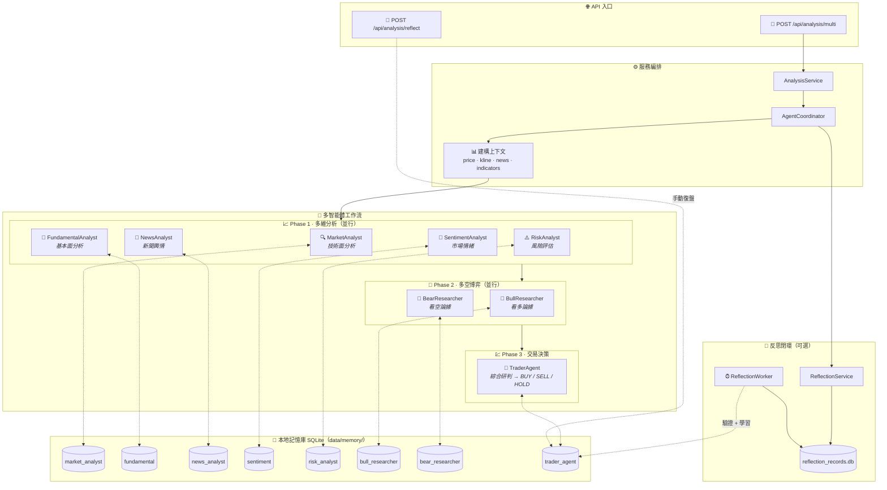

<div align="center">
  <a href="README.md">🇺🇸 English</a> |
  <a href="README_CN.md">🇨🇳 简体中文</a> |
  <a href="README_TW.md">🇹🇼 繁體中文</a> |
  <a href="README_JA.md">🇯🇵 日本語</a> |
  <a href="README_KO.md">🇰🇷 한국어</a>
</div>
<br/>

<div align="center">
  <a href="https://github.com/brokermr810/QuantDinger">
    
  </a>

  <h1 align="center">QuantDinger</h1>

  <p align="center">
    <strong>🤖 AI 原生 · 🔒 隱私優先 · 🚀 全能量化工作台</strong>
  </p>
  <p align="center">
    <i>下一代本地量化平台：多市場數據、AI 投研、可視化回測與自動交易。</i>
  </p>

  <p align="center">
    <a href="https://www.quantdinger.com"><strong>官網</strong></a> ·
    <a href="https://ai.quantdinger.com"><strong>在線演示</strong></a> ·
    <a href="https://github.com/brokermr810/QuantDinger/issues"><strong>報告 Bug</strong></a> ·
    <a href="https://github.com/brokermr810/QuantDinger/discussions"><strong>討論區</strong></a>
  </p>

  <p align="center">
    <a href="LICENSE"></a>
    
    
    
    
  </p>

  <p align="center">
    <a href="https://t.me/worldinbroker"></a>
    <a href="https://discord.gg/cn6HVE2KC"></a>
    <a href="https://x.com/HenryCryption"></a>
  </p>
</div>

---

## 📖 簡介

**QuantDinger** 是一個專為交易員、研究員和極客設計的**本地優先**（Local-First）量化交易工作台。

與昂貴的 SaaS 平台不同，QuantDinger 將**數據所有權**歸還給你。它內置了一個**基於 LLM 的多智能體投研團隊**，能夠自動從網絡收集金融情報，結合本地行情數據，生成專業的分析報告，並與你的策略開發、回測及實盤交易流程無縫集成。

### 核心價值
- **🛡️ 隱私優先**：所有策略、交易日誌和 API 密鑰都存儲在你的本地 SQLite 數據庫中。
- **🧠 AI 賦能**：不僅是代碼補全，更是真正的 AI 投研分析師（由 OpenRouter/LLM 驅動）。
- **⚡ 多市場支持**：原生支持 **加密貨幣**、**美股**、**A股/港股**、**外匯** 和 **期貨**。
- **🔌 開箱即用**：通過 Docker 一鍵部署。無需復雜的環境配置。

---

## 📚 文檔
- [Python 策略開發指南](docs/STRATEGY_DEV_GUIDE_TW.md)

## 📸 功能預覽

<div align="center">
  <h3>📊 專業量化儀表盤</h3>
  <p>實時監控市場動態、資產狀況和策略狀態。</p>
  
</div>

<br/>

<table align="center" width="100%">
  <tr>
    <td width="50%" align="center" valign="top">
      <h3>🤖 AI 深度投研</h3>
      <p>多智能體協作進行市場情緒與技術分析。</p>
      
    </td>
    <td width="50%" align="center" valign="top">
      <h3>💬 智能交易助手</h3>
      <p>通過自然語言接口獲取即時市場洞察。</p>
      
    </td>
  </tr>
  <tr>
    <td width="50%" align="center" valign="top">
      <h3>📈 交互式指標分析</h3>
      <p>豐富的技術指標庫，支持拖拽式分析。</p>
      
    </td>
    <td width="50%" align="center" valign="top">
      <h3>🐍 Python 策略生成</h3>
      <p>內置編輯器，支持 AI 輔助策略代碼編寫。</p>
      
    </td>
  </tr>
</table>

---

## ✨ 關鍵特性

### 1. 通用數據引擎
無需再為數據 API 發愁。QuantDinger 採用了強大的數據源工廠模式：
- **加密貨幣**：**直連交易所 API** 進行交易（支持 10+ 交易所），結合 **CCXT** 獲取行情數據（支持 100+ 來源）。
- **股票**：集成 Yahoo Finance、Finnhub、Tiingo (美股) 和 AkShare (A股/港股)。
- **期貨/外匯**：支持 OANDA 及主要期貨數據源。
- **代理支持**：內置代理配置，適應受限網絡環境。

### 2. AI 多智能體投研
你不知疲倦的分析師團隊：
- **協調智能體**：拆解任務並管理工作流。
- **搜索智能體**：進行全網搜索（Google/Bing）獲取宏觀新聞。
- **加密/股票智能體**：專注於特定市場的技術和資金流向分析。
- **報告生成**：自動產出結構化的日報/週報。

### 2.1 🧠 AI 記憶增強系統（Memory-Augmented Agents）
QuantDinger 的多智能體不是「每次從零開始」。後端內建**本地記憶庫 + 反思閉環**：在生成提示詞（prompt）時檢索過往經驗並注入到 system prompt，並可在事後驗證/復盤後把結果寫回記憶庫。

- **本質**：RAG 風格「經驗檢索增強」，**不是**訓練/微調模型權重（零外部向量庫依賴）。
- **隱私**：所有記憶與反思記錄預設落盤在本地 SQLite：`backend_api_python/data/memory/`。

#### 邏輯圖（從請求到記憶閉環）



#### 檢索排序（簡化）
\[
score = w_{sim}\cdot sim + w_{recency}\cdot recency + w_{returns}\cdot returns\_score
\]

#### 兩條「學習」通道
- **手動復盤（推薦）**：`POST /api/analysis/reflect` 寫入真實交易結果（returns/result）
- **自動反思（可選）**：`ENABLE_REFLECTION_WORKER=true` 後，背景任務按 `REFLECTION_WORKER_INTERVAL_SEC` 驗證到期記錄並寫回記憶

#### 关键環境變量（`.env`）
- `ENABLE_AGENT_MEMORY`, `AGENT_MEMORY_TOP_K`, `AGENT_MEMORY_CANDIDATE_LIMIT`
- `AGENT_MEMORY_ENABLE_VECTOR`, `AGENT_MEMORY_EMBEDDING_DIM`
- `AGENT_MEMORY_HALF_LIFE_DAYS`, `AGENT_MEMORY_W_SIM`, `AGENT_MEMORY_W_RECENCY`, `AGENT_MEMORY_W_RETURNS`
- `ENABLE_REFLECTION_WORKER`, `REFLECTION_WORKER_INTERVAL_SEC`

### 3. 穩健的策略運行時
- **基於線程的執行器**：獨立的線程池管理策略執行。
- **自動恢復**：系統重啟後自動恢復運行中的策略。
- **掛單工作線程**：可靠的後台隊列確保信號精準執行，防止滑點。

### 4. 現代技術棧
- **後端**：Python (Flask) + SQLite + Redis (可選) — 簡潔、強大、易擴展。
- **前端**：Vue 2 + Ant Design Vue + KlineCharts/ECharts — 響應式且交互豐富。
- **部署**：Docker Compose 編排。

---

## 🏦 支持的交易所與返傭

QuantDinger 支持**直連**主要加密貨幣交易所進行低延遲執行，同時利用 **CCXT** 覆蓋廣泛的行情數據。

> 💡 **獨家福利**：通過下方的合作夥伴鏈接註冊賬戶，可享受**交易手續費減免**和**獨家贈金**。這將在不增加你成本的情況下支持本項目！

| 交易所 | 特點 | 註冊福利 |
|:--------:|:---------|:-------------:|
|  | 🥇 **全球最大**<br/>現貨, 合約, 槓桿 | <a href="https://www.bmwweb.ac/referral/earn-together/refer2earn-usdc/claim?hl=zh-CN&ref=GRO_28502_9OSOJ"></a> |
|  | 🚀 **Web3 & 衍生品**<br/>現貨, 永續, 期權 | <a href="https://www.bjwebptyiou.com/join/14449926"></a> |
|  | 👥 **社交交易**<br/>跟單交易, 合約 | <a href="https://share.glassgs.com/u/H8XZGS71"></a> |

<br>

**同時也支持 (直連/CCXT):**

|  |  |  |  |  |
|:---:|:---:|:---:|:---:|:---:|


---

### 多語言支持

QuantDinger 為全球用戶構建，提供全面的國際化支持：

<p>
  
  
  
  
  
  
  
  
  
  
</p>

所有 UI 元素、錯誤信息和文檔均已完全翻譯。語言會根據瀏覽器設置自動檢測，也可以在應用中手動切換。

---

### 支持的市場

| 市場類型 | 數據源 | 交易 |
|-------------|--------------|---------|
| **加密貨幣** | Binance, OKX, Bitget, + 100 交易所 | ✅ 全面支持 |
| **美股** | Yahoo Finance, Finnhub, Tiingo | ✅ 通過券商 API |
| **A股/港股** | AkShare, 東方財富 | ⚡ 僅數據 |
| **外匯** | Finnhub, OANDA | ✅ 通過券商 API |
| **期貨** | 交易所 API, AkShare | ⚡ 僅數據 |

---

### 架構 (當前倉庫)

```text
┌─────────────────────────────┐
│      quantdinger_vue         │
│   (Vue 2 + Ant Design Vue)   │
└──────────────┬──────────────┘
               │  HTTP (/api/*)
               ▼
┌─────────────────────────────┐
│     backend_api_python       │
│   (Flask + 策略運行時)       │
└──────────────┬──────────────┘
               │
               ├─ SQLite (quantdinger.db)
               ├─ Redis (可選緩存)
               └─ 數據提供商 / LLMs / 交易所
```

---

### 倉庫目錄結構

```text
.
├─ backend_api_python/         # Flask API + AI + 回測 + 策略運行時
│  ├─ app/
│  ├─ env.example              # 複製為 .env 進行本地配置
│  ├─ requirements.txt
│  └─ run.py                   # 入口點
└─ quantdinger_vue/            # Vue 2 UI (開發服務器代理 /api -> 後端)
```

---

## 快速開始

### 選項 1: Docker 部署 (推薦)

運行 QuantDinger 最快的方式。

#### 1. 一鍵啟動

**Linux / macOS**
```bash
git clone https://github.com/brokermr810/QuantDinger.git && \
cd QuantDinger && \
cp docker.env.example backend_api_python/.env && \
docker-compose up -d --build
```

**Windows (PowerShell)**
```powershell
git clone https://github.com/brokermr810/QuantDinger.git
cd QuantDinger
Copy-Item docker.env.example -Destination backend_api_python\.env
docker-compose up -d --build
```

#### 2. 訪問與配置

- **前端 UI**: http://localhost:8888
- **默認賬號**: `quantdinger` / `123456`

> **注意**：為了使用 AI 功能或生產環境安全，請編輯 `backend_api_python/.env`（添加 `OPENROUTER_API_KEY`，修改密碼），然後執行 `docker-compose restart backend` 重啟服務。

#### 3. 訪問應用

- **前端 UI**: http://localhost
- **後端 API**: http://localhost:5000

#### Docker 命令參考

```bash
# 查看運行狀態
docker-compose ps

# 查看日誌
docker-compose logs -f

# 停止服務
docker-compose down

# 停止並刪除卷 (警告：會刪除數據庫！)
docker-compose down -v
```

#### 數據持久化

以下數據掛載到主機，重啟容器後依然保留：

```yaml
volumes:
  - ./backend_api_python/logs:/app/logs                       # 日誌
  - ./backend_api_python/data:/app/data                       # 數據目錄（包含 quantdinger.db）
  - ./backend_api_python/.env:/app/.env                       # 配置文件
```

---

### 選項 2: 本地開發

**先決條件**
- 推薦 Python 3.10+
- 推薦 Node.js 16+

#### 1. 啟動後端 (Flask API)

```bash
cd backend_api_python
pip install -r requirements.txt
cp env.example .env   # Windows: copy env.example .env
python run.py
```

後端將在 `http://localhost:5000` 上可用。

#### 2. 啟動前端 (Vue UI)

```bash
cd quantdinger_vue
npm install
npm run serve
```

前端開發服務器運行在 `http://localhost:8000` 並將 `/api/*` 代理到 `http://localhost:5000`。

---

### 配置 (.env)

使用 `backend_api_python/env.example` 作為模板。常用設置包括：

- **認證**: `SECRET_KEY`, `ADMIN_USER`, `ADMIN_PASSWORD`
- **服務器**: `PYTHON_API_HOST`, `PYTHON_API_PORT`, `PYTHON_API_DEBUG`
- **AI / LLM**: `OPENROUTER_API_KEY`, `OPENROUTER_MODEL`
- **網絡搜索**: `SEARCH_PROVIDER`, `SEARCH_GOOGLE_*`, `SEARCH_BING_API_KEY`
- **代理 (可選)**: `PROXY_PORT` 或 `PROXY_URL`

---

## 🤝 社區與支持

加入我們的全球社區進行策略分享和技術支持：

- **Telegram (官方)**: [t.me/worldinbroker](https://t.me/worldinbroker)
- **Discord**: [Join Server](https://discord.gg/cn6HVE2KC)
- **YouTube**: [@quantdinger](https://youtube.com/@quantdinger)
- **Email**: [brokermr810@gmail.com](mailto:brokermr810@gmail.com)
- **GitHub Issues**: [提交 Bug / 功能請求](https://github.com/brokermr810/QuantDinger/issues)

---

## ☕ 支持本項目

如果 QuantDinger 幫助你獲利，請考慮給開發者買杯咖啡。你的支持讓項目持續發展！

**ERC-20 / BEP-20 / Polygon / Arbitrum**
```
0x96fa4962181bea077f8c7240efe46afbe73641a7
```


---

### 商業服務

我們提供專業服務，助你充分利用 QuantDinger：

| 服務 | 描述 |
|---------|-------------|
| **部署與設置** | 一對一協助服務器部署、配置和優化 |
| **定制策略開發** | 針對特定需求和市場定制交易策略 |
| **企業版升級** | 商業授權、優先支持和企業級高級功能 |
| **培訓與咨詢** | 為你的交易團隊提供實戰培訓和戰略咨詢 |

**感興趣？** 聯繫我們：
- 📧 Email: [brokermr810@gmail.com](mailto:brokermr810@gmail.com)
- 💬 Telegram: [@worldinbroker](https://t.me/worldinbroker)

---

### 致謝

QuantDinger 站在這些偉大的開源項目肩膀之上：Flask, Pandas, CCXT, Vue.js, Ant Design Vue, KlineCharts 等。

感謝所有維護者和貢獻者！ ❤️

